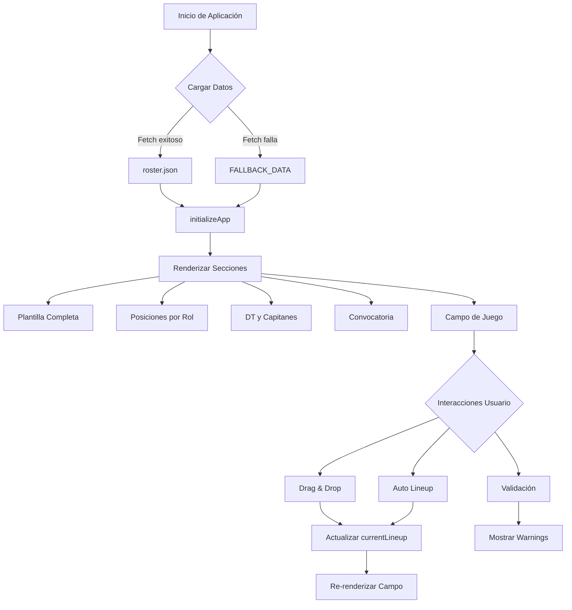

# Sistema de Gestión de Alineación - Tránsito de Girón

## 📋 Índice

1. [Arquitectura Actual](#arquitectura-actual)
2. [Flujo de Datos](#flujo-de-datos)
3. [Componentes Principales](#componentes-principales)
4. [Guía de Migración a React](#guía-de-migración-a-react)
5. [Mejores Prácticas](#mejores-prácticas)

---

## 🏗️ Arquitectura Actual

### Estructura de Archivos

```
TORNEO DE FUTBOL/
├── index.html              # Estructura HTML principal
├── styles.css              # Estilos globales y componentes
├── script.js               # Lógica de aplicación (1434 líneas)
└── data/
    └── roster.json         # Datos de jugadores y configuración
```

### Stack Tecnológico Actual

- **Frontend**: Vanilla JavaScript (ES5)
- **Estilos**: CSS puro con variables CSS
- **Datos**: JSON estático con fetch API
- **Interactividad**: Drag & Drop nativo HTML5

---

## 🔄 Flujo de Datos



### Flujo de Inicialización

1. **DOMContentLoaded** → `initRoster()`
2. **Carga de Datos**:
   - Intenta `fetch('./data/roster.json')`
   - Si falla → usa `FALLBACK_DATA`
3. **Inicialización**: `initializeApp()`
   - `renderPositionLists()` - Muestra jugadores por posición
   - `renderFullRoster()` - Grid completo de jugadores
   - `renderDT()` - Director técnico
   - `renderCaptains()` - Lista de capitanes
   - `renderConvocatoria()` - Jugadores disponibles
   - `initializeEmptyLineup()` - Campo vacío o con datos guardados
   - `updateConvocatoriaStats()` - Estadísticas

---

## 🧩 Componentes Principales

### 1. **Gestión de Estado Global**

```javascript
var rosterData = {}; // Datos de jugadores
var currentLineup = []; // Alineación actual
var draggedPlayerId = null; // ID del jugador siendo arrastrado
```

### 2. **Módulos Funcionales**

#### A. Carga de Datos

- `initRoster()` - Carga inicial
- `FALLBACK_DATA` - Datos de respaldo

#### B. Renderizado

- `renderPositionLists()` - Jugadores por posición
- `renderFullRoster()` - Grid de tarjetas
- `renderDT()` - Tarjeta del DT
- `renderCaptains()` - Lista de capitanes
- `renderConvocatoria()` - Panel de convocados
- `createFieldSlot()` - Slots del campo

#### C. Drag & Drop

- `handleDragStart()` - Inicio de arrastre
- `handleDragOver()` - Sobre zona válida
- `handleSlotDrop()` - Soltar en slot
- `handleFieldFreeDrop()` - Soltar en campo libre

#### D. Gestión de Lineup

- `autoLineup()` - Generación automática
- `clearLineup()` - Limpiar campo
- `resetLineup()` - Restaurar original
- `validateLineup()` - Validación de reglas

#### E. Utilidades

- `showNotification()` - Notificaciones toast
- `toggleDarkMode()` - Cambio de tema
- `exportLineupToPNG()` - Exportar imagen

---

## ⚛️ Guía de Migración a React

### Fase 1: Setup Inicial

#### 1.1 Crear Proyecto React

```bash
npx create-react-app torneo-futbol-react
cd torneo-futbol-react
npm install
```

#### 1.2 Dependencias Recomendadas

```bash
npm install @dnd-kit/core @dnd-kit/sortable  # Drag & Drop moderno
npm install react-hot-toast                   # Notificaciones
npm install zustand                           # State management
npm install html2canvas                       # Export PNG
npm install lucide-react                      # Iconos
```

### Fase 2: Estructura de Carpetas

```
src/
├── components/
│   ├── Layout/
│   │   ├── Header.jsx
│   │   └── Navbar.jsx
│   ├── Roster/
│   │   ├── RosterGrid.jsx
│   │   ├── PlayerCard.jsx
│   │   └── PositionList.jsx
│   ├── Lineup/
│   │   ├── Field.jsx
│   │   ├── FieldSlot.jsx
│   │   ├── FormationSelector.jsx
│   │   └── LineupActions.jsx
│   ├── Convocatoria/
│   │   ├── ConvocatoriaPanel.jsx
│   │   └── ConvocadoItem.jsx
│   ├── Staff/
│   │   ├── DTCard.jsx
│   │   └── CaptainsList.jsx
│   └── UI/
│       ├── Button.jsx
│       ├── Modal.jsx
│       └── Toast.jsx
├── hooks/
│   ├── useRosterData.js
│   ├── useLineup.js
│   └── useDragAndDrop.js
├── store/
│   └── useStore.js          # Zustand store
├── utils/
│   ├── validation.js
│   ├── formations.js
│   └── export.js
├── data/
│   └── roster.json
└── styles/
    ├── globals.css
    └── variables.css
```

### Fase 3: Migración de Estado

#### 3.1 Zustand Store (Recomendado)

```javascript
// src/store/useStore.js
import { create } from "zustand";
import { persist } from "zustand/middleware";

export const useStore = create(
  persist(
    (set, get) => ({
      // Estado
      rosterData: null,
      currentLineup: [],
      convocados: [],
      formation: "2-2-2",
      darkMode: false,

      // Acciones
      setRosterData: (data) => set({ rosterData: data }),

      updateLineup: (lineup) => set({ currentLineup: lineup }),

      addToLineup: (playerId, position) =>
        set((state) => {
          const newLineup = [...state.currentLineup];
          newLineup[position] = { id: playerId };
          return { currentLineup: newLineup };
        }),

      removeFromLineup: (position) =>
        set((state) => {
          const newLineup = [...state.currentLineup];
          newLineup[position] = { id: null };
          return { currentLineup: newLineup };
        }),

      toggleDarkMode: () =>
        set((state) => ({
          darkMode: !state.darkMode,
        })),

      // Validación
      validateLineup: () => {
        const { currentLineup, rosterData } = get();
        const issues = [];

        const filledSlots = currentLineup.filter((p) => p.id);
        const hasVeteran = filledSlots.some(
          (p) => rosterData.players[p.id]?.veteran,
        );

        if (!hasVeteran && filledSlots.length > 0) {
          issues.push({
            type: "error",
            text: "Debe incluir al menos un veterano",
          });
        }

        return issues;
      },
    }),
    {
      name: "lineup-storage",
      partialPersist: (state) => ({
        currentLineup: state.currentLineup,
        darkMode: state.darkMode,
      }),
    },
  ),
);
```

### Fase 4: Componentes Clave

#### 4.1 Hook de Datos

```javascript
// src/hooks/useRosterData.js
import { useEffect } from "react";
import { useStore } from "../store/useStore";
import { FALLBACK_DATA } from "../data/fallback";

export const useRosterData = () => {
  const setRosterData = useStore((state) => state.setRosterData);

  useEffect(() => {
    fetch("./data/roster.json")
      .then((res) => res.json())
      .then((data) => setRosterData(data))
      .catch((err) => {
        console.warn("Fetch failed, using fallback:", err);
        setRosterData(FALLBACK_DATA);
      });
  }, [setRosterData]);
};
```

#### 4.2 Componente Field

```javascript
// src/components/Lineup/Field.jsx
import { useDroppable } from "@dnd-kit/core";
import { useStore } from "../../store/useStore";
import FieldSlot from "./FieldSlot";
import { FORMATIONS } from "../../utils/formations";

export default function Field() {
  const { currentLineup, formation } = useStore();
  const positions = FORMATIONS[formation];

  const { setNodeRef } = useDroppable({
    id: "field-droppable",
  });

  return (
    <div ref={setNodeRef} className="field">
      {positions.map((pos, index) => (
        <FieldSlot
          key={index}
          position={pos}
          index={index}
          player={currentLineup[index]}
        />
      ))}
    </div>
  );
}
```

#### 4.3 Componente FieldSlot

```javascript
// src/components/Lineup/FieldSlot.jsx
import { useDraggable, useDroppable } from "@dnd-kit/core";
import { useStore } from "../../store/useStore";

export default function FieldSlot({ position, index, player }) {
  const { rosterData, removeFromLineup } = useStore();
  const playerData = player?.id ? rosterData.players[player.id] : null;

  const { setNodeRef: setDropRef } = useDroppable({
    id: `slot-${index}`,
  });

  const {
    attributes,
    listeners,
    setNodeRef: setDragRef,
  } = useDraggable({
    id: `player-${player?.id}`,
    disabled: !player?.id,
  });

  if (!playerData) {
    return (
      <div
        ref={setDropRef}
        className={`field-slot empty-slot ${position.class}`}
      >
        <i className="fas fa-plus" />
      </div>
    );
  }

  return (
    <div
      ref={(node) => {
        setDropRef(node);
        setDragRef(node);
      }}
      className={`field-slot occupied-slot ${position.class}`}
      {...listeners}
      {...attributes}
    >
      <div className="player-field-number">{playerData.number}</div>
      <div className="player-content">
        <div className="player-field-name">
          {playerData.name}
          {playerData.veteran && <i className="fas fa-star" />}
        </div>
        {playerData.rating && (
          <div className="player-field-rating">
            {playerData.rating.toFixed(1)}
          </div>
        )}
      </div>
      <button
        className="remove-player-btn"
        onClick={() => removeFromLineup(index)}
      >
        <i className="fas fa-times" />
      </button>
    </div>
  );
}
```

### Fase 5: Migración de Estilos

#### 5.1 CSS Modules (Recomendado)

```css
/* Field.module.css */
.field {
  position: relative;
  background-color: #34d399;
  background-image:
    repeating-linear-gradient(
      0deg,
      transparent,
      transparent 49px,
      rgba(255, 255, 255, 0.1) 49px,
      rgba(255, 255, 255, 0.1) 50px
    ),
    repeating-linear-gradient(
      90deg,
      transparent,
      transparent 49px,
      rgba(255, 255, 255, 0.1) 49px,
      rgba(255, 255, 255, 0.1) 50px
    );
  border-radius: var(--radius);
  padding: 1rem;
  min-height: 500px;
}
```

#### 5.2 Tailwind CSS (Alternativa)

```bash
npm install -D tailwindcss postcss autoprefixer
npx tailwindcss init -p
```

```javascript
// Ejemplo con Tailwind
<div className="relative bg-emerald-400 rounded-xl p-4 min-h-[500px]">
  {/* Field content */}
</div>
```

---

## 🎯 Mejores Prácticas

### 1. **Separación de Responsabilidades**

```
✅ BIEN:
- Componentes pequeños y reutilizables
- Lógica en hooks personalizados
- Estado global en Zustand
- Utilidades en archivos separados

❌ MAL:
- Componentes gigantes con toda la lógica
- Estado duplicado en múltiples lugares
- Lógica de negocio en componentes UI
```

### 2. **Performance**

```javascript
// Memoización de componentes pesados
import { memo } from "react";

const PlayerCard = memo(
  ({ player }) => {
    // ...
  },
  (prevProps, nextProps) => {
    return prevProps.player.id === nextProps.player.id;
  },
);

// useMemo para cálculos costosos
const sortedPlayers = useMemo(() => {
  return players.sort((a, b) => b.rating - a.rating);
}, [players]);
```

### 3. **TypeScript (Altamente Recomendado)**

```typescript
// types/player.ts
export interface Player {
  name: string;
  number: string;
  veteran: boolean;
  rating: number;
  strengths: string[];
  improvements: string[];
}

export interface RosterData {
  players: Record<string, Player>;
  positions: {
    porteros: PositionEntry[];
    defensas: PositionEntry[];
    medio: PositionEntry[];
    delanteros: PositionEntry[];
  };
  captains: Captain[];
  dt: { id: string };
  field: FieldPosition[];
}
```

### 4. **Testing**

```javascript
// __tests__/Field.test.jsx
import { render, screen } from "@testing-library/react";
import Field from "../components/Lineup/Field";

test("renders empty field slots", () => {
  render(<Field />);
  const emptySlots = screen.getAllByRole("button");
  expect(emptySlots).toHaveLength(6);
});
```

### 5. **Accesibilidad**

```javascript
// Agregar ARIA labels
<button
  aria-label={`Remover ${playerData.name} de la alineación`}
  onClick={handleRemove}
>
  <i className="fas fa-times" />
</button>

// Keyboard navigation
<div
  role="button"
  tabIndex={0}
  onKeyDown={(e) => e.key === 'Enter' && handleClick()}
>
```

---

## 📦 Plan de Migración Paso a Paso

### Semana 1: Setup y Estructura

- [ ] Crear proyecto React
- [ ] Instalar dependencias
- [ ] Configurar estructura de carpetas
- [ ] Migrar estilos a CSS Modules
- [ ] Setup Zustand store

### Semana 2: Componentes Base

- [ ] Migrar Header y Navbar
- [ ] Crear componentes UI (Button, Modal, Toast)
- [ ] Implementar tema oscuro con Context
- [ ] Migrar PlayerCard y RosterGrid

### Semana 3: Lineup y Drag & Drop

- [ ] Implementar Field component
- [ ] Configurar @dnd-kit
- [ ] Migrar lógica de drag & drop
- [ ] Implementar validación de lineup

### Semana 4: Features Avanzadas

- [ ] Auto-lineup algorithm
- [ ] Export to PNG
- [ ] LocalStorage persistence
- [ ] Testing básico

### Semana 5: Polish y Deploy

- [ ] Optimización de performance
- [ ] Accesibilidad
- [ ] Deploy a Vercel/Netlify
- [ ] Documentación

---

## 🚀 Ventajas de la Migración

1. **Mantenibilidad**: Código más organizado y fácil de mantener
2. **Performance**: Re-renders optimizados con React
3. **Developer Experience**: Hot reload, mejor debugging
4. **Ecosistema**: Acceso a miles de librerías React
5. **Testing**: Mejor infraestructura de testing
6. **TypeScript**: Type safety opcional
7. **Escalabilidad**: Fácil agregar nuevas features

---

## 📚 Recursos Adicionales

- [React Docs](https://react.dev)
- [Zustand](https://github.com/pmndrs/zustand)
- [@dnd-kit](https://dndkit.com)
- [React Testing Library](https://testing-library.com/react)
- [Tailwind CSS](https://tailwindcss.com)
